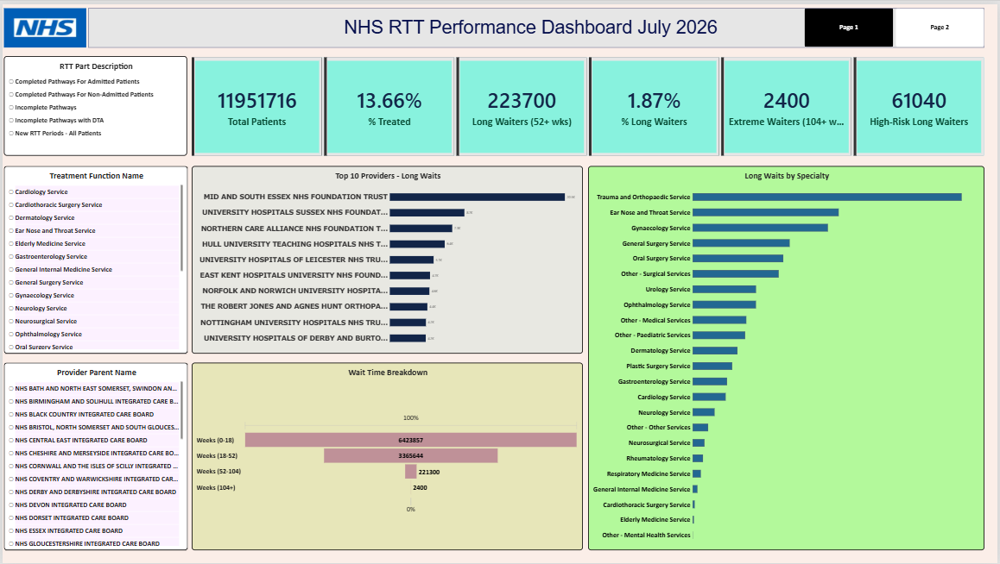
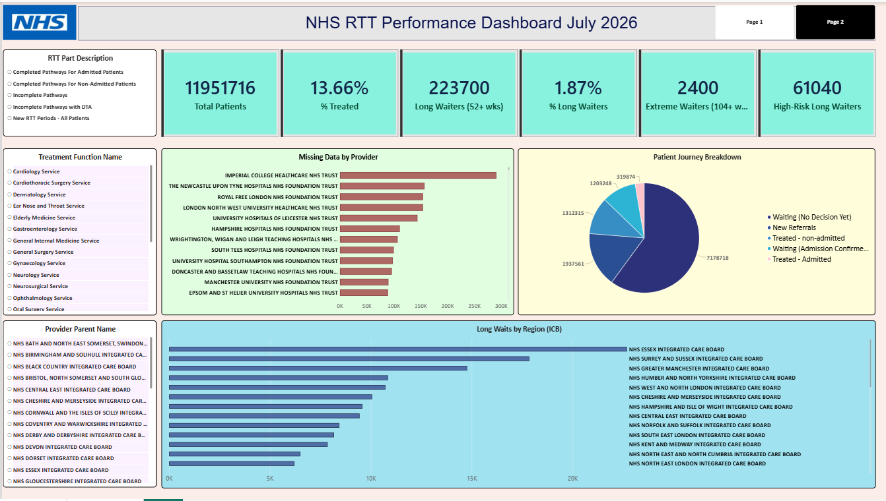
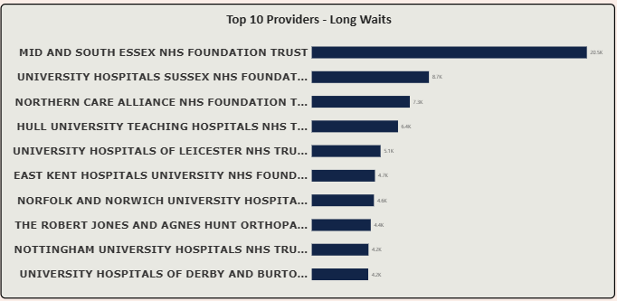
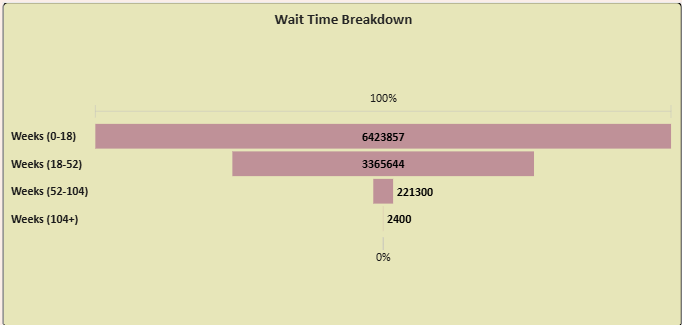

# NHS RTT Waiting Times - Data Quality Investigation & Performance Dashboard

A data quality investigation and Power BI dashboard built on NHS England's Referral to Treatment (RTT) Waiting Times data for June 2026. This project moves from raw CSV → validated MySQL data → SQL-verified KPIs → an interactive Power BI dashboard, with every finding backed by an executable query.




---

## 1. Problem Statement

NHS waiting times are a critical public health and policy concern in England. Long delays between referral and treatment can worsen clinical outcomes, increase patient anxiety, and draw public scrutiny of NHS performance.

This project investigates two things:
1. **Is this dataset trustworthy?** - Before drawing any conclusion from it, the data was tested against seven specific data quality risks.
2. **What does it actually show?** - Once validated, the data was used to build a Power BI dashboard surfacing the KPIs and views NHS management would need to prioritise intervention.

---

## 2. Dataset

| | |
|---|---|
| **Source** | [NHS England RTT Waiting Times](https://www.england.nhs.uk/statistics/statistical-work-areas/rtt-waiting-times/), official open dataset |
| **Period** | June 2026 |
| **Size** | 182,411 rows (182,412 lines including header) |
| **Format** | CSV → imported into MySQL |
| **Structure** | 13 identifier/category columns, 105 weekly wait-band columns (`Gt 00 To 01 Weeks` … `Gt 104 Weeks`), 3 summary columns |

Full column-by-column definitions are in [`docs/NHS_RTT_Project_Documentation.docx`](docs/NHS_RTT_Project_Documentation.pdf).

**RTT Part Type reference:**

| Code | Meaning |
|---|---|
| Part_1A | Completed Pathways - Admitted Patients |
| Part_1B | Completed Pathways - Non-Admitted Patients |
| Part_2 | Incomplete Pathways (still waiting, no decision yet) |
| Part_2A | Incomplete Pathways with DTA (waiting, admission confirmed) |
| Part_3 | New RTT Periods - All Patients |

---

## 3. Data Quality Findings

Seven checks were run against the imported data before any KPI was trusted. Every result below is backed by an executable query in [`sql/03_data_quality_checks.sql`](sql/03_data_quality_checks.sql).

| # | Check | Result |
|---|---|---|
| 1 | Commissioner Code = 0 anomaly | **0 rows affected** - not present |
| 2 | Total Validation (week bands = Total) | **Reconciled** - no mismatches |
| 3 | Negative values (all 108 numeric columns) | **0 found** |
| 4 | Duplicate rows | **0 found** at the correct grain |
| 5 | C_999 "Total" rollup rows | **Confirmed as summary rows** - excluded from all specialty-level analysis |
| 6 | Missing values by provider | Profiled and reported - NULLs preserved, never replaced with 0 |
| 7 | Part_2 vs Part_2A distinction | Confirmed as **distinct, legitimate** pathway stages, not a data error |

**Key finding on data structure:** `Treatment_Function_Code = 'C_999'` is a pre-calculated rollup row (its `Total_All` equals the sum of every real specialty for the same Provider/Commissioner/RTT Part combination). Every specialty-level query in this project excludes it with `WHERE Treatment_Function_Code <> 'C_999'` - without this, every specialty figure would be roughly doubled.

---

## 4. KPIs

Calculated first in SQL for validation, then rebuilt as DAX measures for the live dashboard.

| KPI | Result | Definition |
|---|---|---|
| Total Patient Volume | **11,951,716** | SUM(Total_All), excluding C_999 |
| % Patients Treated | **13.66%** | (Part_1A + Part_1B) ÷ Total Patients |
| Long Waiters (52+ weeks) | **223,700** | SUM of week bands 52–104+ |
| % Long Waiters | **1.87%** | Long Waiters ÷ Total Patients |
| Extreme Long Waiters (104+ weeks) | **~2,400** | SUM(Gt 104 Weeks) |
| High-Risk Specialty Long-Waiter Count | **~61,000** | 52+ week waiters within Cardiology, Cardiothoracic Surgery, Neurosurgery, General Surgery, Urology, Gynaecology, Respiratory Medicine |

Full SQL for each KPI: [`sql/04_kpi_queries.sql`](sql/04_kpi_queries.sql). DAX measures: [`dax/`](dax/).

---

## 5. Dashboard

Built in Power BI Desktop with 6 KPI cards, interactive slicers, and the following views:

1. **Provider League Table** - Top 10 providers by 52+ week waiters
2. **Waiting Time Distribution** - patient volume across 0-18 / 18-52 / 52-104 / 104+ week bands
3. **Specialty Breakdown** - all 23 real specialties ranked by long-waiter count
4. **Regional (ICB) Comparison** - long-waiter ranking across all Integrated Care Boards
5. **Interactive slicers** - RTT Part Description, Treatment Function Name, Provider Parent Name
6. **Data Completeness Table** - NULL count per provider, for escalation to data owners
7. **Patient Journey Breakdown** - 5-stage view from New Referral through to Treated




---

## 6. Waiting Time Findings

- **1.87%** of all patients (223,700) have breached the 52-week threshold NHS England treats as a critical reporting and funding trigger.
- Roughly **61,000** long waiters sit within seven clinically high-risk specialties, where delay carries the greatest risk of irreversible harm - giving management a prioritised, clinically-grounded intervention list rather than a generic backlog count.
- The full Specialty and Regional breakdowns allow management to distinguish a **targeted, fixable** problem (concentrated in a few providers/specialties) from a **systemic capacity issue** (spread evenly across the system).

---

## 7. Business Impact

**For NHS management decision-making:**
- The 52-week and 104-week figures can be reported with confidence, since the underlying data was validated end-to-end before use.
- The Provider League Table and High-Risk Specialty KPI give a prioritised, actionable shortlist for intervention - not just an abstract national average.

**For data governance:**
- The Data Completeness table gives data owners a direct, auditable list of which providers are under-reporting.
- The Data Quality Validation Summary demonstrates the dataset was tested against seven specific risks before being used for reporting - proof of trustworthiness, not just an absence of complaints.
- The C_999 exclusion rule prevents an entire class of double-counting error from silently inflating every specialty-level KPI on this or any future dashboard built on this dataset.

---

## 8. Tools Used

- **MySQL** - data import (`LOAD DATA INFILE`), schema design, all data quality and KPI validation queries
- **Power BI Desktop** - dashboard build, DAX measures, slicers, page navigation
- **Power Query** - column transformation and cleansing support
- **Excel** - independent cross-verification of totals and negative-value checks

---

## Repository Structure

```
nhs-rtt-data-quality-dashboard/
│
├── README.md
│
├── sql/
│   ├── 01_create_table.sql
│   ├── 02_load_data.sql
│   ├── 03_data_quality_checks.sql
│   └── 04_kpi_queries.sql
│
├── dax/
│   ├── Extreame_long_waits.dax
│   ├── High_risk_long_wait.dax
│   ├── Long_wait_volume.dax
│   ├── Percentage_long_wait_volume.dax
│   ├── Percentage_of_patients_treated.dax
│   ├── Total_null_count.dax
│   ├── Total_patients.dax
│   ├── Total_wait.dax
│   ├── Week (0-18).dax
│   ├── Week (18-52).dax
│   ├── Week (52-104).dax
│   └── Week (104+).dax
│
├── docs/
│   ├── NHS_RTT_Project_Documentation.docx
│   └── KPI_and_Requirements.docx
│
├── images/
│   ├── KPI.png
│   ├── Page_1.png
│   ├── Page_2.png
│   ├── Top_10_Providers_Long_Waits.png
│   ├── Wait_Time_Breakdown.png
│   ├── Long_Waits_by_Specialty.png
│   ├── Long_Wait_by_Region.png
│   ├── Interactive_Filtering.png
│   ├── Missing_Data_by_Provider.png
│   └── Patient_Journey_Breakdown.png
│
└── powerbi/
    └── NHS_RTT.pbix
```

## Data Source & License

Data sourced from NHS England via [data.gov.uk](https://www.england.nhs.uk/statistics/statistical-work-areas/rtt-waiting-times/), published under the [Open Government Licence](https://www.nationalarchives.gov.uk/doc/open-government-licence/version/3/). No patient-identifiable information is included - all figures are pre-aggregated counts at Provider/Commissioner/Specialty level.
